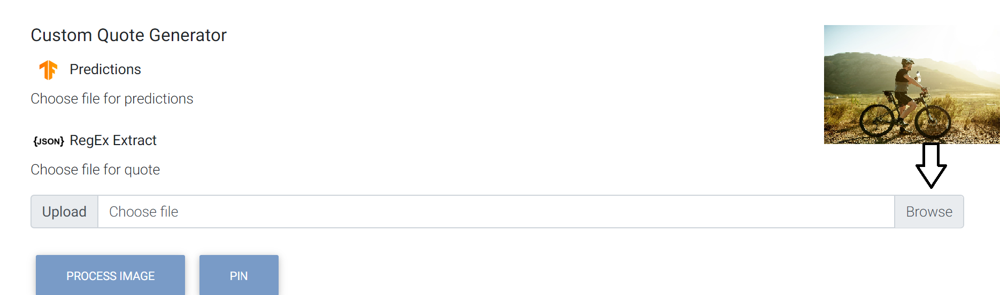
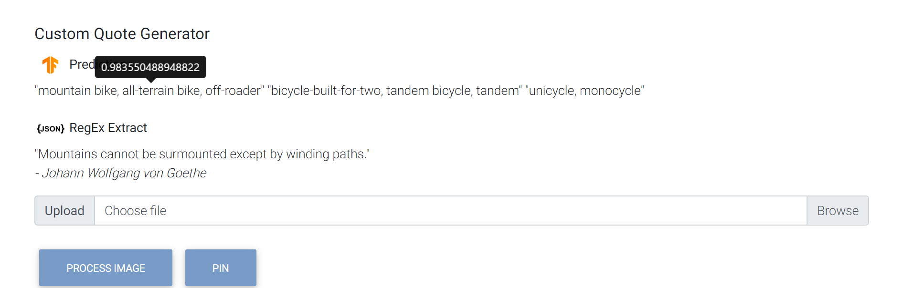

# Inspire

Inspire is a quote generator that allows you to pin your favorite quotes.

You can do the following:

+ Upload an image to get a relevant quote (image processing + RegEx)
+ Get a random quote from 5000+ quotes (random index algorithm)

Powered by TensorFlow — Google's end-to-end open source platform for machine learning.

## Demo 🤓

**Registration Form**


**Sign In Form**


**File Upload Form (Input)**



**Image Classification (Output)**

*Probability is displayed on mouse hover*



**Random Selector**


## Technologies

+ [Node.js](https://nodejs.org/en/)
+ [MongoDB](https://www.mongodb.com/)
+ [Bootstrap](https://getbootstrap.com/)

## Supported Platforms 

+ MacOS X CPU (10.12.6 Siera or higher)
+ Linux CPU (Ubuntu 14.04 or higher)
+ Linux GPU (Ubuntu 14.04 or higher and Cuda 10.0 w/ CUDNN v7)
+ Windows CPU (Win 7 or higher)
+ Windows GPU (Win 7 or higher and Cuda 10.0 w/ CUDNN v7)

## Quick Start 🚀

Open a Command Interpreter with Administrative privileges and run:

```sh
cd /MongoDB/Server/4.2/bin # navigate to bin
net start MongoDB # start the service 
mongo # run MongoDB shell
use users # create a database
db.createCollection('users') # create a collection
git clone https://github.com/omaralsayed/inspire.git # clone repository
cd inspire # navigate to project
npm i # install dependencies
nodemon app.js # deploy on http://127.1.0.1/
```

## Recommended Resources

+ [MobileNet](https://github.com/tensorflow/tfjs-models/tree/master/mobilenet)
+ [EJS templating](https://ejs.co/)
+ [Passport](http://www.passportjs.org/docs/)